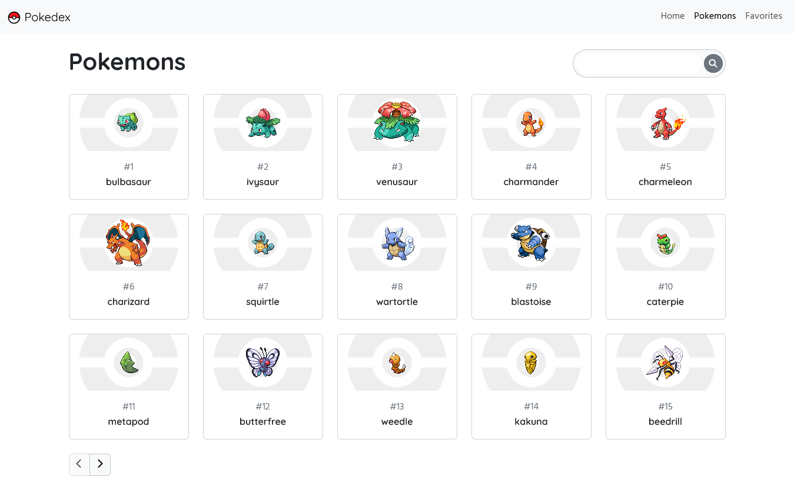

# Vue pokedex

Learning project made with Vue JS, using composition API, vue router and pinia for global stores.

## Table of contents

- [Overview](#overview)
  - [The challenge](#the-challenge)
  - [Site map](#site-map)
    - [Home](#home)
    - [Pokemons](#pokemons)
    - [Favorites](#favorites)
    - [Pokemon view](#pokemon-view)
  - [Project Setup](#project-setup)

## Overview

The app has four sections: Home, Pokemons, Favorites and Pokemon View. This project was developed using vue 3 and bootstrap.

### Screenshot



## Site Map

### Home

The landing page of the app. It has a search bar and a section of last seen pokemons, which stores the last 6 checked pokemons.

### Pokemons

This is the full list of available pokemons. Users can find an especific pokemon using the search bar on the top right, or can browse the list with the paginator.

### Favorites

A simple list with the pokemons listed as favorites by the user. Start empty by default.

### Pokemon view

Page that displays info of the requested pokemon. It shows the pokedex number, name, base stats, types, image and sprites of both regular and shiny variants of the pokemon. Here you can also add the pokemon to your favorites list.

## Project Setup

```sh
npm install
```

### Compile and Hot-Reload for Development

```sh
npm run dev
```

### Compile and Minify for Production

```sh
npm run build
```
